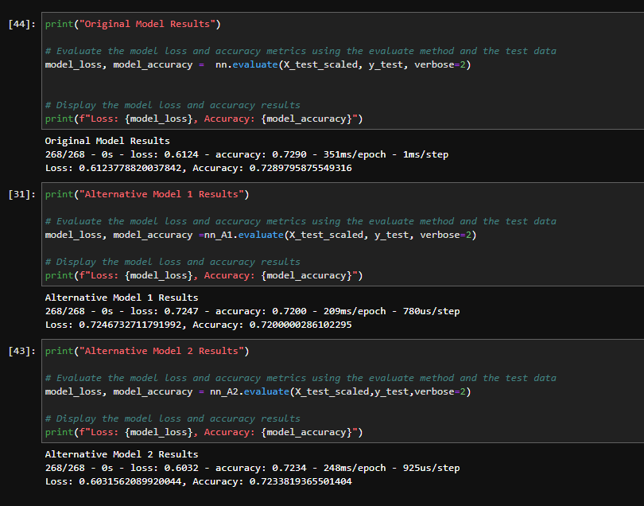

# *Neural Networks*

The purpose of the venture funding file is to create a model that predicts whether applicants for startup money will be successful if funded. The end result is an application that can predict with a high degree of accuracy whether or not funding the startup is a good choice.

---

## **Required Technologies**

This application requires `python 3.7.13` along with the following libraries, `pandas`, `tensorflow` and `scikit-learn`.

---

## Installation Guide

You can install pandas and scikit-learn libraries to your device by running the following prompts in your command line interface (CLI).

```pip install pandas```

```pip install tensorflow```

```conda install -U scikit-learn```

---

## Model Accuracy

Below you can see the accuracy of the neural network models demonstrated in the venture funding file.



---

## Usage

You can initiate the application in your CLI by navigating to the file and opening it.

---

## Contributors

Adam Jimenez - FinTech Student

---

## License

2022 edX Bootcamps

